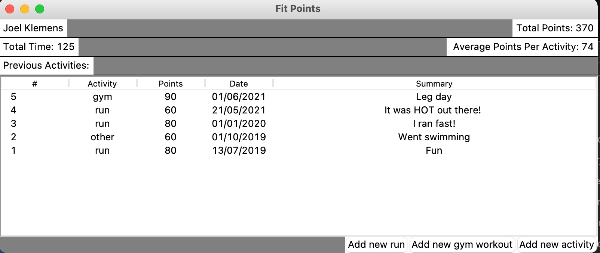

#  README - FitPoints Desktop App - Joel Klemens

## EXPLANATION OF SOFTWARE:
The program works as a simple workout logging system that has functionality for users to create a profile and earn points for exercise.  Depending on how hard and for how long you work out for you are rewarded points.

It can be hard to compete against your friends when you are on different levels of physical fitness, however, with FitPoints you can compete based on how much relative effort you give over the duration of an exercise based on average heart rate.

## HOW TO INSTALL PYTHON3:
1.    LINK: https://realpython.com/installing-python/
2.    Use the above link to find step by step instructions on how to install python3 on your operating system
## HOW TO INSTALL MYSQL CONNECTOR:
1.    For linux use 'pip3 install mysql-connector'
2.    You will also need SQL: 'pip3 install pymysql'
## HOW TO INSTALL TK:
1.    If you do not already have tk please go to this website and follow the steps, 'https://tkdocs.com/tutorial/install.html'
## HOW TO INSTALL REQUESTS
1. In terminal 'sudo pip3 install requests'
## HOW TO INSTALL ZEEP
1. In terminal 'sudo pip3 install zeep'

## HOW TO USE

## These instructions no longer apply as I no longer have access to school db which was used to store all user data
## I have modified the program slightly so that you are able to log in
#### Username: J01 Password: 1234

->In the file 'Database.py' on line 33-35 you will need to enter your student central log in id for 'dbName' and for 'uName' and you student number for 'passwd'.  I would have left mine in there but for peer review this needs to be anonymous.  You should be able to connect to the school sql server using this.  

->For the submission to the instructor I have left in my user name and student number for logging into the school database as well as left one user profile in the 'user_logs' for examples. If you would like to create your own profile please do so, however, please feel free to use the login 'J01' with password '1234' for and example user profile.

1.    Navigate to the A3 folder through the command line
2.    Type make, it is a single file so the makefile is super simple
3.    You will be asked to log in or create a profile
4.    Feel free to create your own.
5.    Once logged in you will be able to see your name, total time, a list of previous activities with some stats about each, a running total of points and average points for a workout.
6.    To create a new activity to be added to the list use one of the buttons at the bottom and then follow instructions.

## USER STORIES
1.    As a user I would like to log my workouts
2.    As a user I would like to score points in order to compete with friends
3.    As a user I would like to have a personal account
4.    As a user I would like to log different types of workouts
5.    As a user I would like to see statistics on my workouts
6.    As a user I would like to save my activities to view when I login to my account
7.    As a user I would like to be able to use a web API to view my profile from other devices. [API]
8.    As a coach I would like to access my athlete's history to see how they are doing with their workouts. [API]
9.    As a user I would like to be able to update my recent workouts from internet connected devices. [API]

## EXAMPLES OF SOAP AND REST (These were required to be added as part of the assignment)
-> These are two short and sweet consumptions that do the simplest possible request.
-> REST can be found in FitPoints.py on line 78, request to get an inspirational quote in form of a json string.
-> SOAP can be found in FitPoints.py on line 85, request that will get back information about Canada / any country you request.

## CONTRAST AND COMPARISON OF SOAP AND REST
###### WHAT IS SOAP
-> SOAP stands for Simple Object Access Protocol.  This is a messaging protocol for exchanging structured information for web services accross a computer network. SOAP uses XML for its messaging format and relies on HTTP and SMTP for message transmission. SOAP was developed so that applications that are built in different programming languages can easily communicate without extra development effort. A SOAP message is made up of three elements.  The envelope which identifies the XML document as a SOAP message.  Header element that contains header information and a body element that contains call and response information.  

###### WHAT IS REST
-> REST stands for Representational State Transfer.  REST is a software architectural that provides constraints that are used for creating web services. This provides standards for systems on the web to transfer data between each other. Systems that conform to these standards are refered to as RESTful systems. They are known for being stateless and having separation of client and server.  The system does not need to know anything about the state that the client is in, nor does the client need to know the state of the server.  The separation comes from the ability to make changes in the code of the server and the client without affecting the operation of either. This improves on the coupling of the system as a whole.

###### DIFFERENCES BETWEEN THEM
-> SOAP is an official protocol, very strict standards and security features.
-> REST guidelines are less strict and allow for developers to implement it in their own way

-> SOAP only allows for the usage of XML files
-> REST can be used with XML, JSON, plain text, YAML, HTML, etc.

-> SOAP can be classified as somewhat heavyweight
-> REST is lightweight (uses less bandwidth)

-> SOAP has built in ACID complience for security as well as WS-security with SSL support
-> REST only uses SSL and HTTPS

-> SOAP can perform actions through standardized messaging patterns
-> REST used for accessing data

-> REST caches API calls
->SOAP does not

-> SOAP suggested to be used for enterprise apps, when high security is needed, telecommunication, financial applications
-> REST suggest to be used for public API's for web services, social networking, mobile services

###### References for comparison
-> https://raygun.com/blog/soap-vs-rest-vs-json/
-> https://www.codecademy.com/articles/what-is-rest
-> https://stackify.com/soap-vs-rest/
-> https://www.educba.com/soap-vs-rest/
-> https://en.wikipedia.org/wiki/SOAP

## RESOURCES:
•    https://www.datacamp.com/community/tutorials/python-oop-tutorial
•    https://realpython.com/python-exceptions/
•    https://docs.python.org/3/tutorial/classes.html
•    https://www.digitalocean.com/community/tutorials/how-to-define-functions-in-python-3#using-main()-as-a-function
•    https://www.tutorialspoint.com/python/python_linked_lists.htm
•    https://www.tutorialspoint.com/python/python_gui_programming.htm
•    https://www.tutorialspoint.com/python/python_classes_objects.htm
•    https://www.tutorialspoint.com/python/tk_frame.htm
•    https://www.python-course.eu/python3_inheritance.php
•    https://htmlcolorcodes.com/color-picker/
•    http://effbot.org/tkinterbook/pack.htm
•    https://stackoverflow.com/questions/2416486/how-to-create-a-password-entry-field-using-tkinter
•    https://stackoverflow.com/questions/36120426/tkinter-treeview-widget-inserting-data/36131160
•    https://www.digitalocean.com/community/tutorials/how-to-handle-plain-text-files-in-python-3#step-4-%E2%80%94-writing-a-file
•    https://docs.python.org/3/library/tkinter.ttk.html#treeview
•    https://www.w3schools.com/python/python_mysql_drop_table.asp
•    https://www.tutorialspoint.com/mysql/mysql-handling-duplicates.htm
•    https://www.w3schools.com/python/python_mysql_create_table.asp
